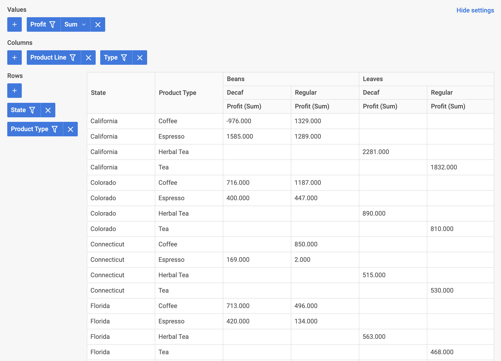

# Integration with Angular

:::tip
You should be familiar with basic concepts and patterns of **Angular** before reading this documentation. To refresh your knowledge, please refer to the [**Angular documentation**](https://angular.io/docs).
:::

DHTMLX Pivot is compatible with **Angular**. We have prepared code examples on how to use DHTMLX Pivot with **Angular**. For more information, refer to the corresponding [**Example on GitHub**](https://github.com/DHTMLX/angular-pivot-demo).

## Creating a project

:::info
Before you start to create a new project, install [**Angular CLI**](https://angular.io/cli) and [**Node.js**](https://nodejs.org/en/).
:::

Create a new **my-angular-pivot-app** project using Angular CLI. Run the following command for this purpose:

~~~json
ng new my-angular-pivot-app
~~~

:::note
If you want to follow this guide, disable Server-Side Rendering (SSR) and Static Site Generation (SSG/Prerendering) when creating new Angular app!
:::

The command above installs all the necessary tools, so you don't need to run any additional commands.

### Installation of dependencies

Go to the new created app directory:

~~~json
cd my-angular-pivot-app
~~~

Install dependencies and start the dev server. For this, use the [**yarn**](https://yarnpkg.com/) package manager:

~~~jsx
yarn
yarn start // or yarn dev
~~~

The app should run on a localhost (for instance `http://localhost:3000`).

## Creating Pivot

Now you should get the DHTMLX Pivot source code. First of all, stop the app and proceed with installing the Pivot package.

### Step 1. Package installation

Download the [**trial Pivot package**](/how-to-start/#installing-trial-pivot-via-npm-and-yarn) and follow steps mentioned in the README file. Note that trial Pivot is available 30 days only.
  
### Step 2. Component creation

Now you need to create an Angular component, to add Pivot into the application. Create  the **pivot** folder in the ***src/app/*** directory, add a new file into it and name it ***pivot.component.ts***. Then complete the steps described below.

#### Import source files

Open the file and import Pivot source files. Note that:

- if you use PRO version and install the Pivot package from a local folder, the imported path looks like this:

~~~jsx
import { Pivot } from 'dhx-pivot-package';
~~~

- if you use the trial version of Pivot, specify the following path:

~~~jsx
import { Pivot } from '@dhx/trial-pivot';
~~~

In this tutorial you can see how to configure the **trial** version of Pivot.

#### Set the container and initialize Pivot

To display Pivot on the page, you need to set the container to render the component inside and initialize Pivot using the corresponding constructor:

~~~jsx {1,8,12-13,18-19} title="pivot.component.ts"
import { Pivot } from '@dhx/trial-pivot';
import { Component, ElementRef, OnInit, ViewChild, OnDestroy, ViewEncapsulation } from '@angular/core';

@Component({
    encapsulation: ViewEncapsulation.None,
    selector: "pivot", // a template name used in the "app.component.ts" file as <pivot />
    styleUrls: ["./pivot.component.css"], // include a css file
    template: `

`,
})

export class PivotComponent implements OnInit, OnDestroy {
    // initialize container for Pivot
    @ViewChild('container', { static: true }) pivot_container!: ElementRef;

    private _table!: Pivot;

    ngOnInit() {
        // initialize the Pivot component
        this._table = new Pivot(this.pivot_container.nativeElement, {});
    }

    ngOnDestroy(): void {
        this._table.destructor(); // destruct Pivot
    }
}
~~~

#### Adding styles

To display Pivot correctly, you need to provide the corresponding styles. For this purpose, you can create the ***pivot.component.css*** file in the ***src/app/pivot/*** directory and specify important styles for Pivot and its container:

~~~css title="pivot.component.css"
/* import Pivot styles */
@import "@dhx/trial-pivot/dist/pivot.css";

/* specify styles for initial page */
html,
body {
    margin: 0;
    padding: 0;
    height: 100%;
}

/* specify styles for the Pivot container */
.widget {
    width: 100%;
    height: 100%;
}
~~~

#### Loading data

To add data into Pivot, you need to provide a data set. You can create the ***data.ts*** file in the ***src/app/pivot/*** directory and add some data into it:

~~~jsx title="data.ts"
export function getData() {
    const dataset = [
        {
            "cogs": 51,
            "date": "10/1/2018",
            "inventory_margin": 503,
            "margin": 71,
            "market_size": "Major Market",
            "market": "Central",
            "marketing": 46,
            "product_line": "Leaves",
            "product_type": "Herbal Tea",
            "product": "Lemon",
            "profit": -5,
            "sales": 122,
            "state": "Colorado",
            "expenses": 76,
            "type": "Decaf"
        },
        {
            "cogs": 52,
            "date": "10/1/2018",
            "inventory_margin": 405,
            "margin": 71,
            "market_size": "Major Market",
            "market": "Central",
            "marketing": 17,
            "product_line": "Leaves",
            "product_type": "Herbal Tea",
            "product": "Mint",
            "profit": 26,
            "sales": 123,
            "state": "Colorado",
            "expenses": 45,
            "type": "Decaf"
        }, // othe data items
    ];

    const fields: any = [
        {
            "id": "cogs",
            "label": "Cogs",
            "type": "number"
        },
        {
            "id": "date",
            "label": "Date",
            "type": "date"
        }, // other fields
    ];

    return { dataset, fields };
};
~~~

Then open the ***pivot.component.ts*** file. Import the file with data and specify the corresponding data properties to the configuration object of Pivot within the `ngOnInit()` method, as shown below.

~~~jsx {2,18,20-21} title="pivot.component.ts"
import { Pivot } from '@dhx/trial-pivot';
import { getData } from "./data"; // import data
import { Component, ElementRef, OnInit, ViewChild, OnDestroy, ViewEncapsulation } from '@angular/core';

@Component({
    encapsulation: ViewEncapsulation.None,
    selector: "pivot", 
    styleUrls: ["./pivot.component.css"],
    template: `

`,
})

export class PivotComponent implements OnInit, OnDestroy {
    @ViewChild('container', { static: true }) pivot_container!: ElementRef;

    private _table!: Pivot;

    ngOnInit() {
        const { dataset, fields } = getData(); // initialize data properties
        this._table = new Pivot(this.pivot_container.nativeElement, {
            fields,
            data: dataset,
            config: {
                rows: ["state", "product_type"],
                columns: ["product_line", "type"],
                values: [
                    {
                        field: "profit",
                        method: "sum"
                    }, // other values
                ]
            },
            // other configuration properties
        });
    }

    ngOnDestroy(): void {
        this._table.destructor(); 
    }
}
~~~

Now the Pivot component is ready to use. When the element will be added to the page, it will initialize the Pivot with data. You can provide necessary configuration settings as well. Visit our [Pivot API docs](/api/overview/properties-overview/) to check the full list of available properties.

#### Handling events

When a user makes some action in the Pivot, it invokes an event. You can use these events to detect the action and run the desired code for it. See the [full list of events](/api/overview/events-overview/).

Open the ***pivot.component.ts*** file and complete the `ngOnInit()` method as in:

~~~jsx {18-20} title="pivot.component.ts"
// ...
ngOnInit() {
    this._table = new Pivot(this.pivot_container.nativeElement, {
        fields,
        data: dataset,
        config: {
            rows: ["state", "product_type"],
            columns: ["product_line", "type"],
            values: [
                {
                    field: "profit",
                    method: "sum"
                }, // other values
            ]
        }
    });

    this._table.api.on("open-filter", (ev) => {
        console.log("The field id for which filter is activated:", ev.id);
    });
}

ngOnDestroy(): void {
    this._table.destructor(); 
}
~~~

### Step 3. Adding Pivot into the app

To add the ***PivotComponent*** into the app, open the ***src/app/app.component.ts*** file and replace the default code with the following one:

~~~jsx {5} title="app.component.ts"
import { Component } from "@angular/core";

@Component({
    selector: "app-root",
    template: `<pivot/>` // a template created in the "pivot.component.ts" file 
})
export class AppComponent {
    name = "";
}
~~~

Then create the ***app.module.ts*** file in the ***src/app/*** directory and specify the *PivotComponent* as shown below:

~~~jsx {4-5,8} title="app.module.ts"
import { NgModule } from "@angular/core";
import { BrowserModule } from "@angular/platform-browser";

import { AppComponent } from "./app.component";
import { PivotComponent } from "./pivot/pivot.component";

@NgModule({
    declarations: [AppComponent, PivotComponent],
    imports: [BrowserModule],
    bootstrap: [AppComponent]
})
export class AppModule {}
~~~

The last step is to open the ***src/main.ts*** file and replace the existing code with the following one:

~~~jsx title="main.ts"
import { platformBrowserDynamic } from "@angular/platform-browser-dynamic";
import { AppModule } from "./app/app.module";
platformBrowserDynamic()
    .bootstrapModule(AppModule)
    .catch((err) => console.error(err));
~~~

After that, you can start the app to see Pivot loaded with data on a page.

Now you know how to integrate DHTMLX Pivot with Angular. You can customize the code according to your specific requirements. The final example you can find on [**GitHub**](https://github.com/DHTMLX/angular-pivot-demo).
