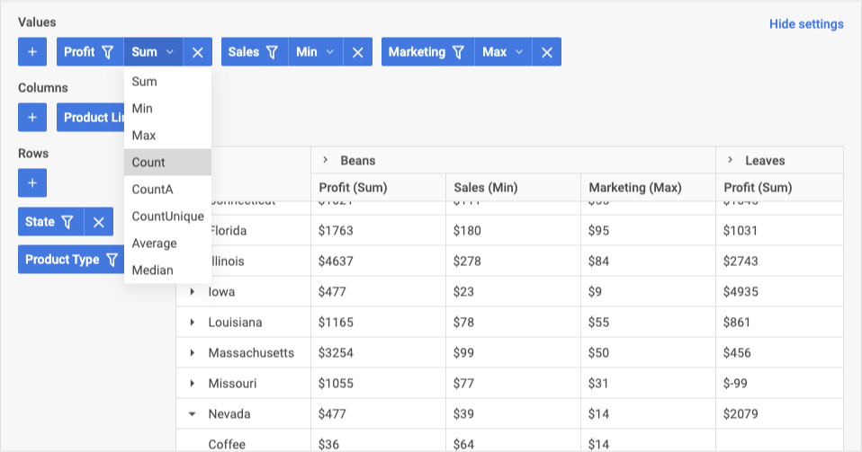
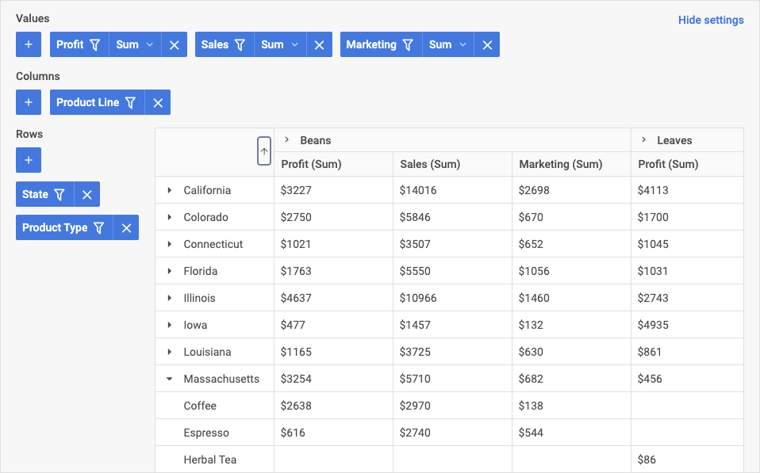

# DHTMLX Pivot overview

JavaScript Pivot library is a ready-made component for creating Pivot tables from large datasets. The widget API can be easily adjusted to the needs of your web application. It provides the end user with functionality for comparing and analyzing complex data within one table.

## Pivot structure­

The Pivot UI consists of the two main components: the Configuration panel and the table with data.

## Configuration panel

The Configuration panel allows adding columns and rows to the table as well as values' fields that define data aggregation methods. You can add each item via the next areas in the panel: 

- Values: you can add values that define how data is aggregated (such as sum, min, max values)
- Columns: you can configure columns of the table (define which fields will be applied as columns)
- Rows: you can configure which fields should be applied as rows of the table

To hide the Configuration panel, click the **Hide Settings** button:

### Values area

In the **Values** area you can define which aggregation methods (such as min, max, count) will be applied to the cells of the Pivot table. You can perform the next operations:

- add and remove fields to/from the values area
- change the order and priority of values in the table
- filter data 
- set operations that will be applied to the fields of the table

For more details, please refer to the [Operations in areas](#operations-in-areas) and [Filters](#filters) sections.

### Columns area

In the **Columns** area, you can perform the following operations:

- add and remove columns (i.e., add/remove fields applied as columns) 
- change the order and priority of columns in the table
- filter data 

For more details, please refer to the [Operations in areas](#operations-in-areas) and [Filters](#filters) sections.

### Rows area

In the Configuration panel for the **Rows** area, you can perform the following operations:

- add and remove rows (i.e., add/remove fields applied as rows) 
- change the order and priority of rows in the table
- filter data 

For more details, please refer to the [Operations in areas](#operations-in-areas) and [Filters](#filters) sections.

### Operations in areas

In all three areas of the Configuration panel you can add and remove fields to/from the table. If you want some field to be applied as a row or column, select it in the appropriate area (columns or rows). 

To add a new field, in the required area, click the "+" button and select the name from the drop-down list. 

To remove a value, click the delete button ("x").

To change the order of values/rows/columns in the table, drag an item to the desired position. The closer an item is to the left in the toolbar list, the higher its priority and position in the table. 

To set operations that will be applied to all data of the column of the table, in the **Values** area, click the value operation for the required field in the drop-down list, and select the required option from the list.

### Filters

Filters appear as drop-down lists for each field in all areas. The Pivot provides the next condition types for filtering:

- for text values: equal, notEqual, contains, notContains, beginsWith, notBeginsWith, endsWith, notEndsWith  
- for numeric values: greater: less, greaterOrEqual, lessOrEqual, equal,	notEqual, contains, notContains, begins with, not begins with, ends with, not ends with  
- for date types: greater, less, greaterOrEqual, lessOrEqual, equal, notEqual, between, notBetween

To filter data in the table, click the filter sign of one of the items in the required area, and then select the operator and set the value to filter by, and then click **Apply**.

The fields to which filtering is applied are marked with a special filter sign:

## Table

Data in the table is displayed as configured in the Configuration panel. The **sorting** in columns is enabled by default:

:::info
The image above displays the table in its default mode but you can easily change the look and behavior of the table. The widget API provides rich functionality for configuring the table such as enabling the tree mode with collapsible rows, resizing the table, freezing columns while scrolling, applying templates, and much more. 
:::

## What's next

Now you can get down to incorporating Pivot into your application. Follow the directions of the [How to start](./how-to-start) tutorial for guidance.

If you apply the functionality provided by the widget API you can get a good-looking Pivot table with more features as the one in the sample below:

<iframe src="https://snippet.dhtmlx.com/4cm4asbd?mode=result" frameborder="0" class="snippet_iframe" width="100%" height="600"></iframe> 

