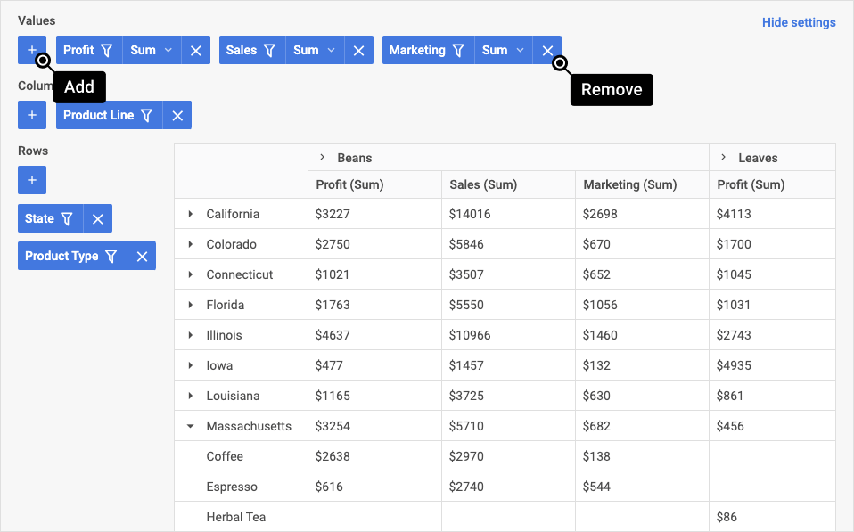
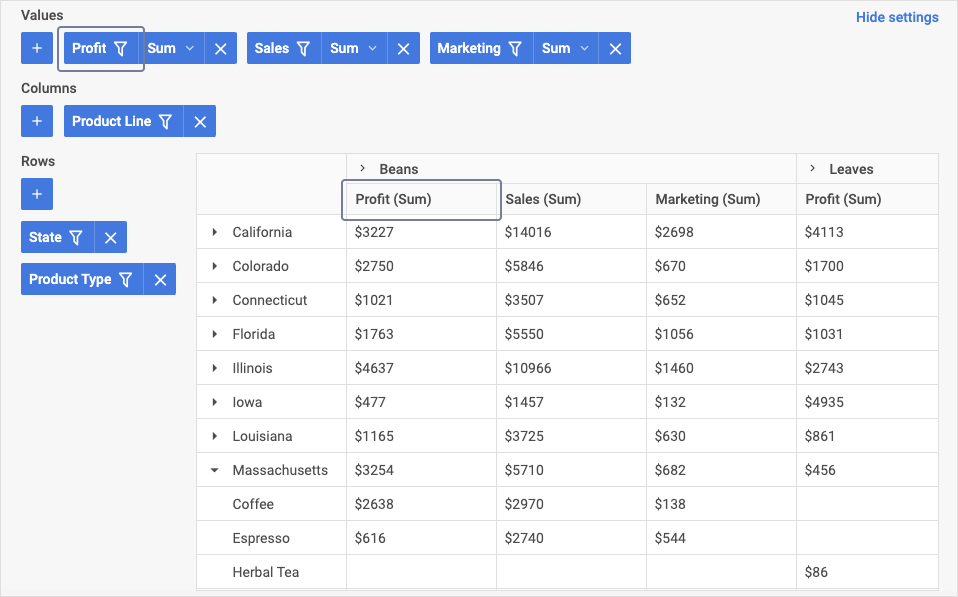

# DHTMLX Pivot – Übersicht {#dhtmlx-pivot-overview}

Die JavaScript Pivot-Bibliothek ist eine fertige Komponente zur Erstellung von Pivot-Tabellen aus großen Datensätzen. Die Widget-API lässt sich problemlos an die Anforderungen Ihrer Webanwendung anpassen. Sie bietet dem Endbenutzer Funktionen zum Vergleichen und Analysieren komplexer Daten innerhalb einer einzigen Tabelle.

## Aufbau von Pivot {#pivot-structure}

Die Pivot-Oberfläche besteht aus zwei Hauptkomponenten: dem Konfigurationsbereich und der Datentabelle.

## Konfigurationsbereich {#configuration-panel}

Im Konfigurationsbereich können Sie der Tabelle Spalten und Zeilen sowie Wertefelder hinzufügen, die die Datenaggregationsmethoden festlegen. Jedes Element lässt sich über die folgenden Bereiche im Panel hinzufügen:

- Werte: Sie können Werte hinzufügen, die bestimmen, wie Daten aggregiert werden (z. B. Summe, Minimum, Maximum)
- Spalten: Sie können die Spalten der Tabelle konfigurieren (festlegen, welche Felder als Spalten verwendet werden)
- Zeilen: Sie können festlegen, welche Felder als Zeilen der Tabelle verwendet werden sollen

Um den Konfigurationsbereich auszublenden, klicken Sie auf die Schaltfläche **Einstellungen ausblenden**:

### Wertebereich {#values-area}

Im **Wertebereich** können Sie festlegen, welche Aggregationsmethoden (z. B. Minimum, Maximum, Anzahl) auf die Zellen der Pivot-Tabelle angewendet werden. Sie können folgende Operationen ausführen:

- Felder zum Wertebereich hinzufügen und daraus entfernen
- Reihenfolge und Priorität der Werte in der Tabelle ändern
- Daten filtern
- Operationen festlegen, die auf die Felder der Tabelle angewendet werden

Weitere Einzelheiten finden Sie in den Abschnitten [Operationen in Bereichen](#operations-in-areas) und [Filter](#filters).

### Spaltenbereich {#columns-area}

Im **Spaltenbereich** können Sie folgende Operationen ausführen:

- Spalten hinzufügen und entfernen (d. h. als Spalten verwendete Felder hinzufügen/entfernen)
- Reihenfolge und Priorität der Spalten in der Tabelle ändern
- Daten filtern

Weitere Einzelheiten finden Sie in den Abschnitten [Operationen in Bereichen](#operations-in-areas) und [Filter](#filters).

### Zeilenbereich {#rows-area}

Im Konfigurationsbereich für den **Zeilenbereich** können Sie folgende Operationen ausführen:

- Zeilen hinzufügen und entfernen (d. h. als Zeilen verwendete Felder hinzufügen/entfernen)
- Reihenfolge und Priorität der Zeilen in der Tabelle ändern
- Daten filtern

Weitere Einzelheiten finden Sie in den Abschnitten [Operationen in Bereichen](#operations-in-areas) und [Filter](#filters).

### Operationen in Bereichen {#operations-in-areas}

In allen drei Bereichen des Konfigurationsbereichs können Sie Felder zur Tabelle hinzufügen und daraus entfernen. Wenn ein Feld als Zeile oder Spalte verwendet werden soll, wählen Sie es im entsprechenden Bereich (Spalten oder Zeilen) aus.

Um ein neues Feld hinzuzufügen, klicken Sie im gewünschten Bereich auf die Schaltfläche „+" und wählen Sie den Namen aus der Dropdown-Liste aus.

Um ein Element zu entfernen, klicken Sie auf die Löschen-Schaltfläche („x").

Um die Reihenfolge von Werten, Zeilen oder Spalten in der Tabelle zu ändern, ziehen Sie ein Element an die gewünschte Position. Je weiter links sich ein Element in der Symbolleistenliste des Bereichs befindet, desto höher ist seine Priorität und Position in der Tabelle.

Um Operationen festzulegen, die auf alle Daten einer Tabellenspalte angewendet werden, klicken Sie im **Wertebereich** auf die Wertoperation des gewünschten Felds in der Dropdown-Liste und wählen Sie die gewünschte Option aus der Liste aus.

### Filter {#filters}

Filter werden als Dropdown-Listen für jedes Feld in allen Bereichen angezeigt. Pivot unterstützt die folgenden Bedingungstypen zum Filtern:

- für Textwerte: equal, notEqual, contains, notContains, beginsWith, notBeginsWith, endsWith, notEndsWith
- für numerische Werte: greater, less, greaterOrEqual, lessOrEqual, equal, notEqual, contains, notContains, begins with, not begins with, ends with, not ends with
- für Datumstypen: greater, less, greaterOrEqual, lessOrEqual, equal, notEqual, between, notBetween

Um Daten in der Tabelle zu filtern, klicken Sie auf das Filtersymbol eines der Elemente im gewünschten Bereich, wählen Sie dann den Operator aus, legen Sie den Filterwert fest und klicken Sie auf **Anwenden**. Felder, auf die eine Filterung angewendet wird, werden mit einem speziellen Filtersymbol markiert.

## Tabelle {#table}

Die Daten in der Tabelle werden so angezeigt, wie sie im Konfigurationsbereich eingestellt wurden. Die **Sortierung** in Spalten wird durch Klicken auf den Spaltenheader aktiviert:

## Nächste Schritte {#whats-next}

Jetzt können Sie mit der Integration von Pivot in Ihre Anwendung beginnen. Folgen Sie den Anweisungen im Tutorial [Erste Schritte](how-to-start.md).

Wenn Sie die vom Widget-API bereitgestellten Funktionen nutzen, erhalten Sie eine ansprechende Pivot-Tabelle mit weiteren Features, wie in dem folgenden Beispiel zu sehen:

<iframe src="https://snippet.dhtmlx.com/4cm4asbd?mode=result" frameborder="0" class="snippet_iframe" width="100%" height="600"></iframe>
