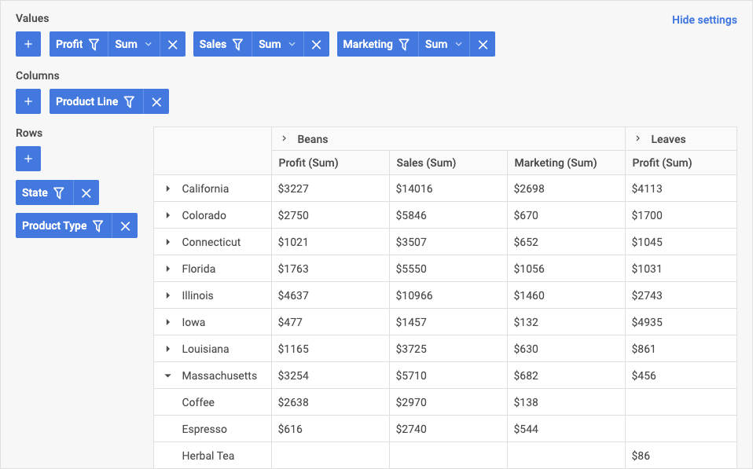
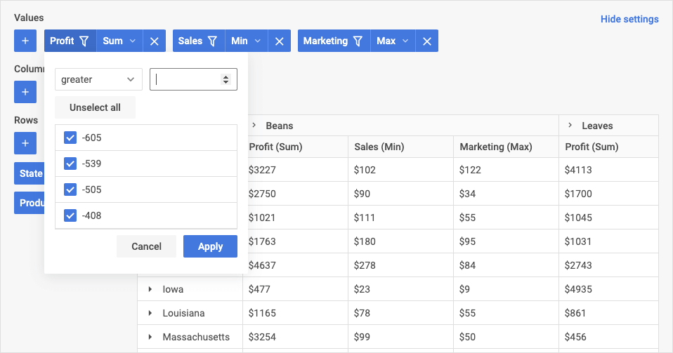

# DHTMLX Pivot 개요

JavaScript Pivot 라이브러리는 대용량 데이터셋으로 피벗 테이블을 생성하기 위한 즉시 사용 가능한 컴포넌트입니다. 위젯 API는 웹 애플리케이션의 요구에 맞게 손쉽게 조정할 수 있습니다. 하나의 테이블 안에서 복잡한 데이터를 비교하고 분석하는 기능을 최종 사용자에게 제공합니다.

## Pivot 구조 {#pivot-structure}

Pivot UI는 구성 패널과 데이터 테이블, 두 가지 주요 컴포넌트로 구성됩니다.

## 구성 패널 {#configuration-panel}

구성 패널에서는 테이블에 열과 행을 추가하고, 데이터 집계 방식을 정의하는 값 필드를 설정할 수 있습니다. 패널의 다음 영역을 통해 각 항목을 추가할 수 있습니다:

- Values: 데이터 집계 방식(합계, 최솟값, 최댓값 등)을 정의하는 값을 추가할 수 있습니다
- Columns: 테이블의 열을 구성합니다(어떤 필드를 열로 적용할지 정의)
- Rows: 테이블의 행으로 적용할 필드를 구성합니다

구성 패널을 숨기려면 **설정 숨기기** 버튼을 클릭하십시오:

### Values 영역 {#values-area}

**Values** 영역에서는 피벗 테이블 셀에 적용할 집계 방식(min, max, count 등)을 정의할 수 있습니다. 다음 작업을 수행할 수 있습니다:

- Values 영역에 필드 추가 및 제거
- 테이블 내 값의 순서와 우선순위 변경
- 데이터 필터링
- 테이블 필드에 적용할 연산 설정

자세한 내용은 [영역 내 연산](#operations-in-areas) 및 [필터](#filters) 섹션을 참조하십시오.

### Columns 영역 {#columns-area}

**Columns** 영역에서는 다음 작업을 수행할 수 있습니다:

- 열 추가 및 제거(열로 적용된 필드 추가/제거)
- 테이블 내 열의 순서와 우선순위 변경
- 데이터 필터링

자세한 내용은 [영역 내 연산](#operations-in-areas) 및 [필터](#filters) 섹션을 참조하십시오.

### Rows 영역 {#rows-area}

**Rows** 영역에 대한 구성 패널에서는 다음 작업을 수행할 수 있습니다:

- 행 추가 및 제거(행으로 적용된 필드 추가/제거)
- 테이블 내 행의 순서와 우선순위 변경
- 데이터 필터링

자세한 내용은 [영역 내 연산](#operations-in-areas) 및 [필터](#filters) 섹션을 참조하십시오.

### 영역 내 연산 {#operations-in-areas}

구성 패널의 세 영역 모두에서 테이블에 필드를 추가하거나 제거할 수 있습니다. 특정 필드를 행 또는 열로 적용하려면 해당 영역(Columns 또는 Rows)에서 선택하십시오.

새 필드를 추가하려면 원하는 영역에서 "+" 버튼을 클릭한 후 드롭다운 목록에서 이름을 선택하십시오.

항목을 제거하려면 삭제 버튼("x")을 클릭하십시오.

테이블에서 값/행/열의 순서를 변경하려면 항목을 원하는 위치로 드래그하십시오. 영역 툴바 목록에서 항목이 왼쪽에 위치할수록 테이블 내 우선순위와 위치가 높아집니다.

테이블 열의 모든 데이터에 적용할 연산을 설정하려면 **Values** 영역에서 원하는 필드의 값 연산을 클릭한 후 목록에서 필요한 옵션을 선택하십시오.

### 필터 {#filters}

필터는 모든 영역의 각 필드에 대해 드롭다운 목록으로 표시됩니다. Pivot은 다음 조건 유형의 필터링을 제공합니다:

- 텍스트 값: equal, notEqual, contains, notContains, beginsWith, notBeginsWith, endsWith, notEndsWith  
- 숫자 값: greater, less, greaterOrEqual, lessOrEqual, equal, notEqual, contains, notContains, begins with, not begins with, ends with, not ends with  
- 날짜 유형: greater, less, greaterOrEqual, lessOrEqual, equal, notEqual, between, notBetween

테이블에서 데이터를 필터링하려면 원하는 영역의 항목에서 필터 아이콘을 클릭한 후 연산자를 선택하고 필터링 기준값을 설정한 다음 **적용**을 클릭하십시오. 필터링이 적용된 필드에는 특별한 필터 아이콘이 표시됩니다.

## 테이블 {#table}

테이블의 데이터는 구성 패널에서 설정한 대로 표시됩니다. 열 헤더를 클릭하면 열 **정렬**이 활성화됩니다:

## 다음 단계 {#whats-next}

이제 Pivot을 애플리케이션에 통합하는 작업을 시작할 수 있습니다. [시작하기](how-to-start.md) 튜토리얼의 안내를 따르십시오.

위젯 API에서 제공하는 기능을 활용하면 아래 샘플과 같이 더 많은 기능을 갖춘 멋진 피벗 테이블을 구현할 수 있습니다:

<iframe src="https://snippet.dhtmlx.com/4cm4asbd?mode=result" frameborder="0" class="snippet_iframe" width="100%" height="600"></iframe> 
