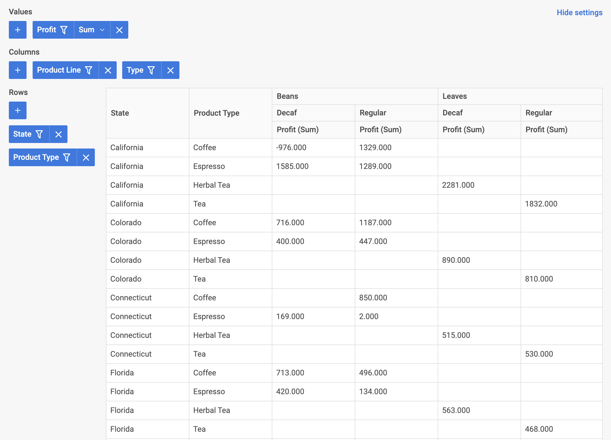

# 与 Vue 集成 {#integration-with-vue}

:::tip
本文假设您已具备 [**Vue**](https://vuejs.org/) 基本概念和模式的相关知识。如需复习，请参阅 [**Vue 3 文档**](https://vuejs.org/guide/introduction.html#getting-started)。
:::

DHTMLX Pivot 可作为普通组件与 **Vue** 集成。完整的工作示例请参见 [**GitHub 上的 Vue Pivot 演示**](https://github.com/DHTMLX/vue-pivot-demo)。

## 创建项目 {#create-a-project}

:::info
开始之前，请先安装 [**Node.js**](https://nodejs.org/en/)。
:::

以下命令将运行官方的 **Vue** 项目脚手架工具：

~~~bash
npm create vue@latest
~~~

该命令会安装并执行 `create-vue`。详情请参阅 [Vue.js 快速入门](https://vuejs.org/guide/quick-start.html#creating-a-vue-application)。

将项目命名为 *my-vue-pivot-app*。

### 安装依赖 {#install-dependencies}

进入新建的项目目录：

~~~bash
cd my-vue-pivot-app
~~~

使用您的包管理器安装依赖并启动开发服务器：

- 使用 [**yarn**](https://yarnpkg.com/)：

~~~bash
yarn
yarn start # 或：yarn dev
~~~

- 使用 [**npm**](https://www.npmjs.com/)：

~~~bash
npm install
npm run dev
~~~

应用将运行在本地端口上（例如 `http://localhost:3000`）。

## 创建 Pivot {#create-pivot}

将 Pivot 包添加到项目中，然后将 Pivot 封装为一个 Vue 组件。

### 第一步：安装包 {#step-1-install-the-package}

下载 [**Pivot 试用包**](how-to-start.md#installing-trial-pivot-via-npm-or-yarn) 并按照 README 中的步骤操作。Pivot 试用包有效期为 30 天。

### 第二步：创建组件 {#step-2-create-the-component}

创建一个用于挂载 Pivot 的 Vue 组件。新建文件 *src/components/Pivot.vue*。

#### 导入源文件 {#import-source-files}

打开 *src/components/Pivot.vue* 并导入 Pivot 源文件。导入路径取决于所使用的包版本：

- **PRO 版本**（从本地文件夹安装）：

~~~html title="Pivot.vue"

~~~

如果包附带的是压缩资源，请导入 *pivot.min.css* 而非 *pivot.css*。

- **试用版本**：

~~~html title="Pivot.vue"

~~~

本教程使用 Pivot 的试用版本。

#### 设置容器并挂载 Pivot {#set-up-the-container-and-mount-pivot}

要在页面上显示 Pivot，需添加一个容器 `div`，然后在 `mounted` 钩子中使用构造函数初始化 Pivot，并在 `unmounted` 钩子中销毁 Pivot。

以下代码片段定义了一个最简化的 Pivot Vue 组件：

~~~html {2,7-8,18} title="Pivot.vue"

<template>
    

</template>
~~~

#### 添加样式 {#add-styles}

为确保 Pivot 正确渲染，请将以下样式添加到项目的主 CSS 文件中：

~~~css title="style.css"
/* 初始页面的样式 */
html,
body,
#app { /* 使用 #app 根容器 */
    height: 100%;
    padding: 0;
    margin: 0;
}

/* Pivot 容器的样式 */
.widget {
    width: 100%;
    height: 100%;
}
~~~

#### 加载数据 {#load-data}

要向 Pivot 传入数据，需准备一个数据集。创建 *src/data.js* 并导出数据及字段元数据：

~~~jsx title="data.js"
export function getData() {
    const dataset = [
        {
            "cogs": 51,
            "date": "10/1/2018",
            "inventory_margin": 503,
            "margin": 71,
            "market_size": "Major Market",
            "market": "Central",
            "marketing": 46,
            "product_line": "Leaves",
            "product_type": "Herbal Tea",
            "product": "Lemon",
            "profit": -5,
            "sales": 122,
            "state": "Colorado",
            "expenses": 76,
            "type": "Decaf"
        },
        {
            "cogs": 52,
            "date": "10/1/2018",
            "inventory_margin": 405,
            "margin": 71,
            "market_size": "Major Market",
            "market": "Central",
            "marketing": 17,
            "product_line": "Leaves",
            "product_type": "Herbal Tea",
            "product": "Mint",
            "profit": 26,
            "sales": 123,
            "state": "Colorado",
            "expenses": 45,
            "type": "Decaf"
        }, // 其他数据项
    ];

    const fields = [
        {
            "id": "cogs",
            "label": "Cogs",
            "type": "number"
        },
        {
            "id": "date",
            "label": "Date",
            "type": "date"
        }, // 其他字段
    ];

    return { dataset, fields };
};
~~~

打开 *src/App.vue*，导入数据并通过 `data()` 选项暴露数据，然后将值作为 props 传递给新的 `<Pivot/>` 组件：

~~~html {3,7-13,18} title="App.vue"

<template>
    <Pivot :fields="fields" :dataset="dataset" />
</template>
~~~

打开 *src/components/Pivot.vue*，声明传入的 props 并将其应用到 Pivot 配置对象中：

~~~html {6,10-11} title="Pivot.vue"

<template>
    

</template>
~~~

组件现已可以使用。挂载后，Pivot 将使用所提供的数据进行渲染。完整的配置属性列表，请参阅 [Pivot API 文档](api/overview/properties-overview.md)。

#### 处理事件 {#handle-events}

用户在 Pivot 中的操作会触发相应的事件，您可以订阅这些事件。完整的事件列表，请参阅[事件概览](api/overview/events-overview.md)。

以下代码片段在 `mounted` 中添加了一个 `open-filter` 事件监听器，当用户打开筛选器时，它会记录对应的字段 ID：

~~~html {22-24} title="Pivot.vue"

// ...
~~~

启动应用，即可看到 Pivot 在页面上渲染数据。

Pivot 现已与 Vue 完成集成。您可以根据项目需求自定义配置。完整示例请参见 [**GitHub 上的 vue-pivot-demo**](https://github.com/DHTMLX/vue-pivot-demo)。
