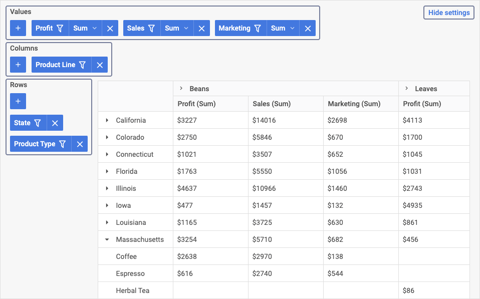
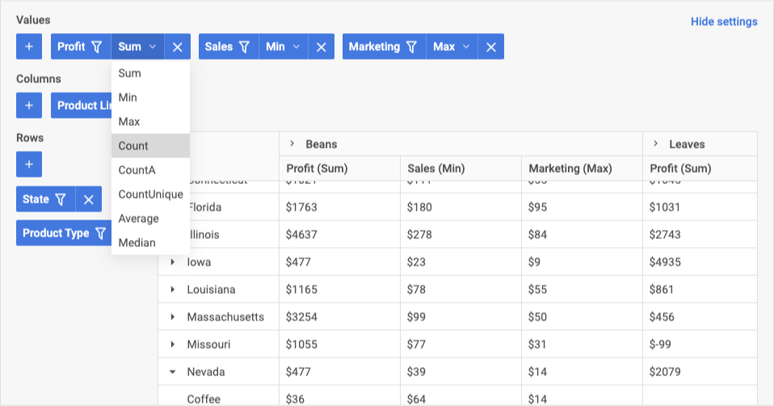
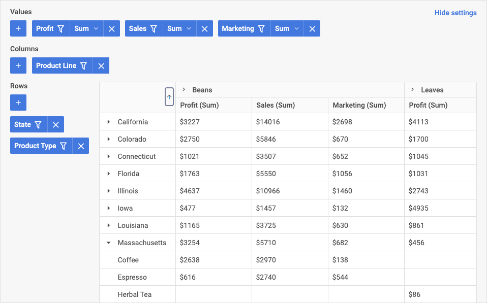

# DHTMLX Pivot 概述

JavaScript Pivot 库是一个现成的组件，用于从大型数据集创建透视表。该 widget API 可以轻松适配您的 Web 应用程序需求。它为最终用户提供了在同一张表中比较和分析复杂数据的功能。

## Pivot 结构 {#pivot-structure}

Pivot 界面由两个主要组件组成：配置面板和数据表格。

## 配置面板 {#configuration-panel}

配置面板允许向表格添加列和行，以及定义数据聚合方法的值字段。您可以通过面板中的以下区域添加各项内容：

- 值：您可以添加定义数据聚合方式的值（例如求和、最小值、最大值）
- 列：您可以配置表格的列（定义哪些字段将作为列使用）
- 行：您可以配置哪些字段应作为表格的行使用

要隐藏配置面板，请点击**隐藏设置**按钮：

### 值区域 {#values-area}

在**值**区域，您可以定义将对透视表单元格应用哪些聚合方法（例如 min、max、count）。您可以执行以下操作：

- 在值区域中添加和移除字段
- 更改表格中值的顺序和优先级
- 筛选数据
- 设置将应用于表格字段的操作

有关更多详情，请参阅[区域操作](#operations-in-areas)和[筛选器](#filters)章节。

### 列区域 {#columns-area}

在**列**区域，您可以执行以下操作：

- 添加和移除列（即添加/移除作为列使用的字段）
- 更改表格中列的顺序和优先级
- 筛选数据

有关更多详情，请参阅[区域操作](#operations-in-areas)和[筛选器](#filters)章节。

### 行区域 {#rows-area}

在配置面板的**行**区域，您可以执行以下操作：

- 添加和移除行（即添加/移除作为行使用的字段）
- 更改表格中行的顺序和优先级
- 筛选数据

有关更多详情，请参阅[区域操作](#operations-in-areas)和[筛选器](#filters)章节。

### 区域操作 {#operations-in-areas}

在配置面板的所有三个区域中，您都可以向表格添加或从表格中移除字段。如果您希望某个字段作为行或列使用，请在相应区域（列或行）中选择它。

要添加新字段，请在所需区域中点击"+"按钮，然后从下拉列表中选择名称。

要移除某项，请点击删除按钮（"x"）。

要更改表格中值/行/列的顺序，请将某项拖动到所需位置。在区域工具栏列表中，某项越靠左，其在表格中的优先级和位置越高。

要设置将应用于表格列所有数据的操作，请在**值**区域中，点击所需字段的值操作下拉列表，然后从列表中选择所需选项。

### 筛选器 {#filters}

筛选器以下拉列表的形式出现在所有区域的每个字段中。Pivot 提供以下条件类型用于筛选：

- 文本值：equal、notEqual、contains、notContains、beginsWith、notBeginsWith、endsWith、notEndsWith
- 数值：greater、less、greaterOrEqual、lessOrEqual、equal、notEqual、contains、notContains、begins with、not begins with、ends with、not ends with
- 日期类型：greater、less、greaterOrEqual、lessOrEqual、equal、notEqual、between、notBetween

要筛选表格中的数据，请点击所需区域中某项的筛选标志，然后选择运算符并设置筛选值，最后点击**应用**。已应用筛选的字段将带有特殊的筛选标志。

## 表格 {#table}

表格中的数据按照配置面板中的设置显示。点击列标题可启用列的**排序**功能：

## 下一步 {#whats-next}

现在您可以开始将 Pivot 集成到您的应用程序中。请参照[快速开始](how-to-start.md)教程的指引进行操作。

如果您使用 widget API 提供的功能，可以获得如下示例所示的具有更多特性的精美透视表：

<iframe src="https://snippet.dhtmlx.com/4cm4asbd?mode=result" frameborder="0" class="snippet_iframe" width="100%" height="600"></iframe> 
